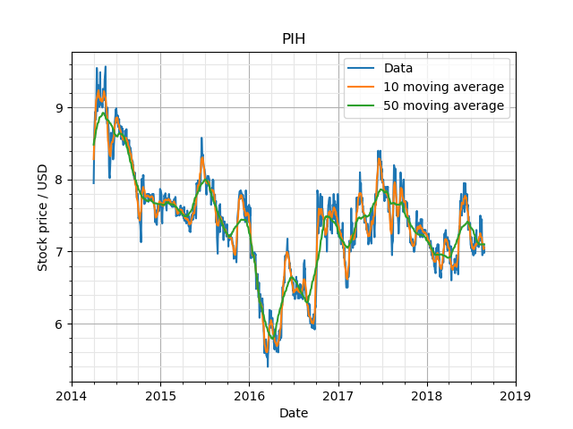

# Basic scrapers and some analysis
This repo was created to see what could be hacked together in a day (~15 hours)

### Learning Outcomes:
+ Setting up and interfacing with MongoDB (locally)
+ Structure of HTML pages to set up web scraping
+ Basics of webscraping static webpages and sifting through JSON for dynamic webpages
+ Loading data from MongoDB into simple algorithms

## Here is what sort of works:
+ Basic heuristic scraping using beautiful soup and urllib (steam, yahoo)
+ Data dump into MongoDB
+ Some basic analytics on the yahoo stock data (Moving averages - Convolutional, GP regression), performed on the MongoDB database

### Future ideas:
+ Dynamic page scraping (using headless browsers)
+ Deeper analytics on scraped data
